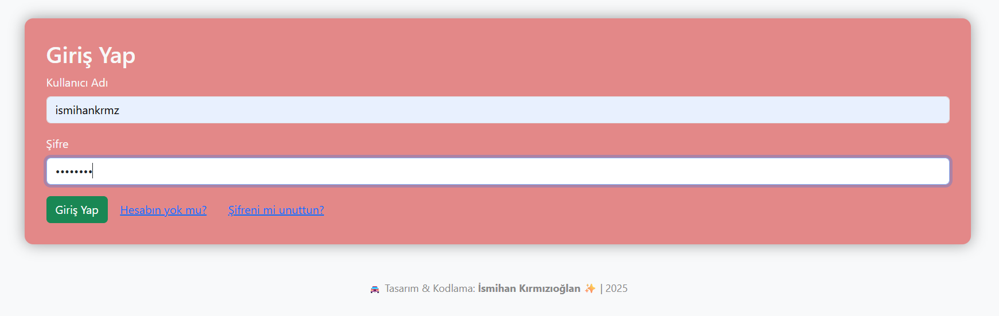
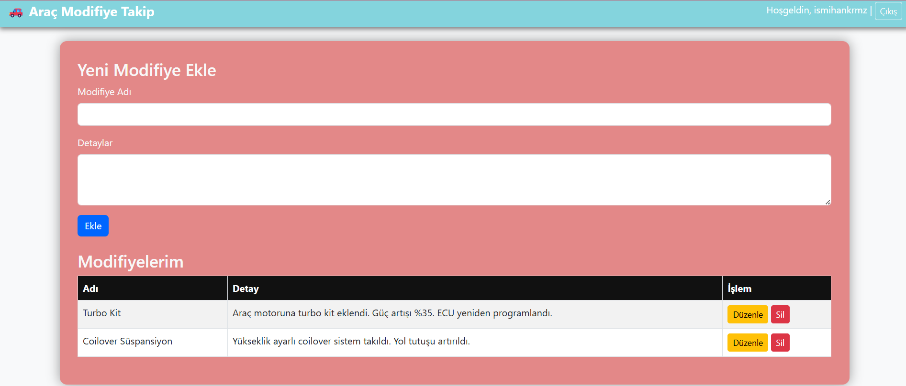

# 🚗 Araç Modifiye Takip Sistemi

Merhaba! Bu proje, *Web Tabanlı Programlama* dersi kapsamında PHP, MySQL, HTML, CSS ve Bootstrap teknolojileri kullanılarak geliştirilmiş bir web uygulamasıdır.  
Amacı, kullanıcıların kendi araçlarına yaptıkları modifiyeleri kayıt altına alması, güncellemesi ve takip etmesini sağlamaktır.

---

## ✨ Özellikler

- ✅ Kullanıcı kayıt olma ve şifreli giriş sistemi (password_hash)
- ✅ Oturum yönetimi (Session tabanlı login/logout)
- ✅ Modifiye ekleme (Create)
- ✅ Kayıtları listeleme (Read)
- ✅ Kayıt güncelleme (Update)
- ✅ Kayıt silme (Delete)
- ✅ Şifre sıfırlama özelliği
- 🎨 Bootstrap + özel CSS ile responsive & modern tasarım
---

## 🧱 Kullanılan Teknolojiler

| Teknoloji    | Açıklama                        |
|--------------|---------------------------------|
| PHP          | Backend & oturum yönetimi       |
| MySQL        | Veritabanı yönetimi             |
| HTML/CSS     | Sayfa iskeleti ve biçimlendirme |
| Bootstrap 5  | Modern arayüz kütüphanesi       |

---

## 🛠 Kurulum

1. XAMPP veya WAMP gibi bir local sunucu kur.
2. arac_modifiye klasörünü htdocs içine yerleştir.
3. PhpMyAdmin üzerinden arac_modifiye adında bir veritabanı oluştur.
4. config.php içinde veritabanı bilgilerini kontrol et.
5. Tarayıcında localhost/arac_modifiye/ yazarak uygulamayı başlat.

---

## 🖼 Ekran Görüntüleri

### 🔐 Giriş Sayfası  

### 📋 Modifiye Sayfası  

---

## 🎥 Tanıtım Videosu

📹 [Tanıtım Videosunu Buradan İzleyin](https://youtu.be/Ok39Bgu-G5I?si=L3AnRoob_AMAt-fr)

---

## 👩‍💻 Geliştirici

- *İsmihan Kırmızıoğlan*  
Bursa Teknik Üniversitesi  
2025 - Bilgisayar Mühendisliği 👩‍💻

---

## 🤖 AI.md Nedir?

Bu projede geliştirici, *ChatGPT* gibi yapay zekâ araçlarından destek almıştır.  
Tüm bu etkileşimler [Yapay Zeka Kullanımları](AI.md) dosyasında dokümante edilmiştir.  
Yalnızca yardımcı araç olarak kullanılmış, özgün içerik geliştirilmiştir.

---

## 📦 Lisans

Bu proje eğitim amacıyla geliştirilmiştir. Her türlü kopya, çalıntı veya intihal işlemi etik dışıdır.  
Lütfen emeğe saygı! 💙
